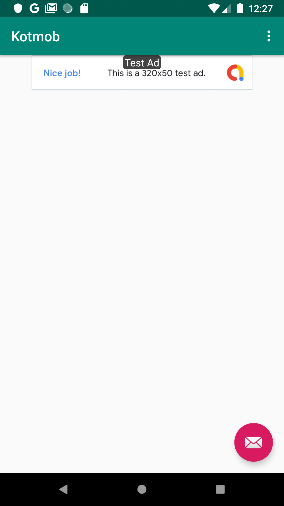
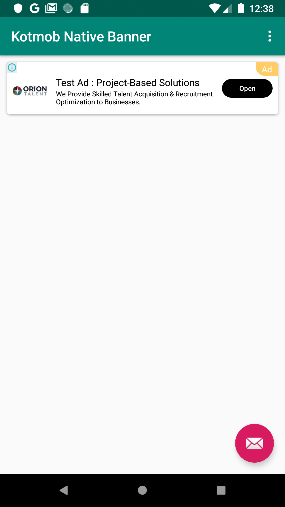
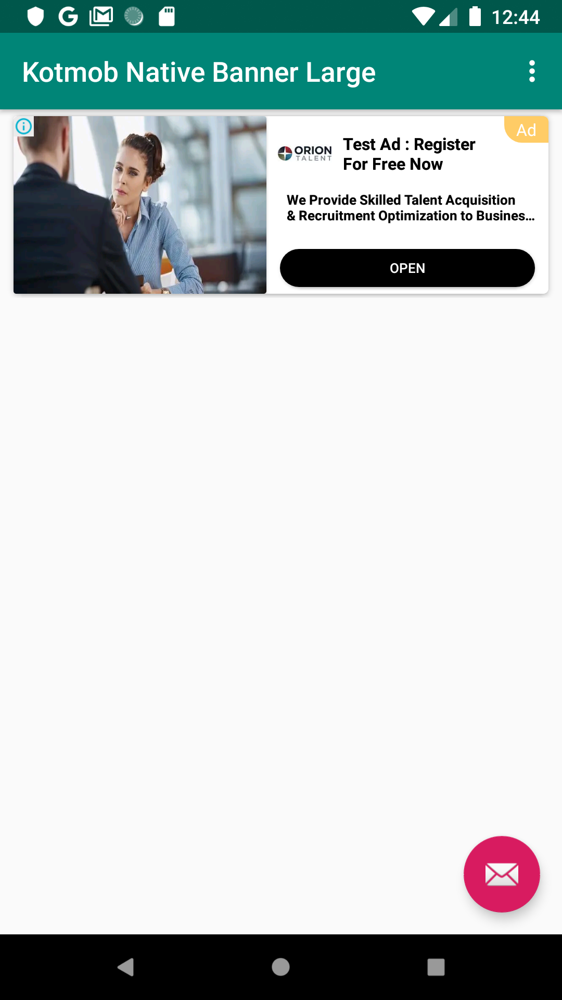
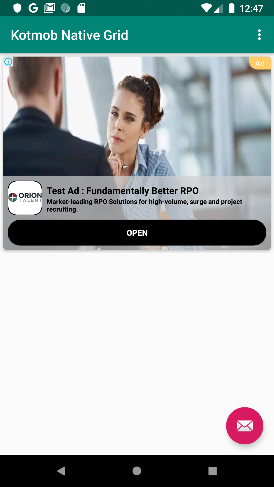

# Current Release


(https://jitpack.io/#amrafridi29/Kotmob/Tag)

# Kotmob
A Simple library to Load Google Native , Banner and Interstitial Admob ads


Preview
---
    


Gradle
------
```
dependencies {
    ...
    implementation 'com.github.amrafridi29:Kotmob:$kotmob_version'
}

allprojects {
    repositories {
       ...
      maven { url 'https://jitpack.io' }
     }
   }
```
Load Banner Ad
---
```
to load banner ad just add this code to your xml layout

<com.kotmob.admoblib.ui.BannerAd
        android:layout_width="match_parent"
        android:layout_height="wrap_content"
        app:banner_ad_id="@string/banner_ad_id"
        />
```


Offline Cross Promotion Ads
---
```
     <com.kotmob.admoblib.ui.OfflineNativeBannerAd
        android:layout_width="match_parent"
        android:layout_height="wrap_content"
        app:ad_title="@string/title"
        app:ad_body="@string/body"
        app:ad_button_text="@string/download"
        app:headline_text_color="@color/colorPrimary"
        app:body_text_color="@color/colorPrimary"
        app:ad_icon="@mipmap/ic_launcher"
        app:ad_app_url="@string/app_url"
       />
       
       <com.kotmob.admoblib.ui.OfflineNativeAd
        android:layout_width="match_parent"
        android:layout_height="wrap_content"
        app:ad_title="@string/title"
        app:ad_body="@string/body"
        app:ad_size="MEDIUM"
        app:ad_button_text="@string/download"
        app:headline_text_color="@color/colorPrimary"
        app:body_text_color="@color/colorPrimary"
        app:ad_icon="@mipmap/ic_launcher"
        app:ad_feature_src="@mipmap/ic_launcher"
        app:ad_app_url="@string/app_url"
       />

```

NativAd Usage XML
-----
```xml
   <com.kotmob.admoblib.ui.KotMobNativeAd
        android:layout_width="match_parent"
        android:layout_height="wrap_content"
        app:ad_view_type="NATIVE_BANNER_MEDIUM"
        app:native_ad_id="@string/native_ad_id"/>


    Optional Xml tags

    app:button_shape
    app:button_text_color
    app:headline_text_color
    app:body_text_color
    app:is_body"
    
```

Kotlin Usage
---
```
call this in your activity or fragment

KotMobNativeAd {
   with(this@MainActivity)
   adView(nativead)
   setAdListener {
      when(it){
       is OnAdListener.OnAdFailedToLoad->it.loadAgain()
       is OnAdListener.OnAdLoaded->it.bindAdView()
     }
   }
 }.load()

```
Available Methods Using NativeAd
---
- adChoicOption(adChoiceOption: ChoiceOption)
- isMedia(isMedia: Boolean)
- isBody(isBody: Boolean) 
- isIcon(isIcon: Boolean)
- isLoader(isLoader: Boolean)

InterstitialAd Usage
---
```
 class App : Application(){


    override fun onCreate() {
        super.onCreate()
         KotMobInterstitial.initialize(this ,interstitial_ad_id)

    }
}

Add this in your activity or fragment

KotMobInterstitial.showInterstitial {
    //do whatever you want
    startActivity(Intent(this, StartActivity::class.java))
}

```


Changelog
---------

* **0.1.0**
    * Initial release
* **0.1.1**
    * Remove Bugs
* **0.1.3**
  * Improve interstitial ads loading and add offline support to native ads loading
* **0.1.4**
 * Add xml attributes
    - ad_background_color
    - ad_background_drawable
    - ad_view_type
        -NATIVE_BANNER
        -NATIVE_BANER_MEDIUM
        -NATIVE_BANER_LARGE
        -NATIVE_GRID


License
-------

    Copyright 2019 Muhammad Amir

    Licensed under the Apache License, Version 1.0 (the "License");
    you may not use this file except in compliance with the License.
    You may obtain a copy of the License at

        http://www.apache.org/licenses/LICENSE-2.0

    Unless required by applicable law or agreed to in writing, software
    distributed under the License is distributed on an "AS IS" BASIS,
    WITHOUT WARRANTIES OR CONDITIONS OF ANY KIND, either express or implied.
    See the License for the specific language governing permissions and
    limitations under the License.
